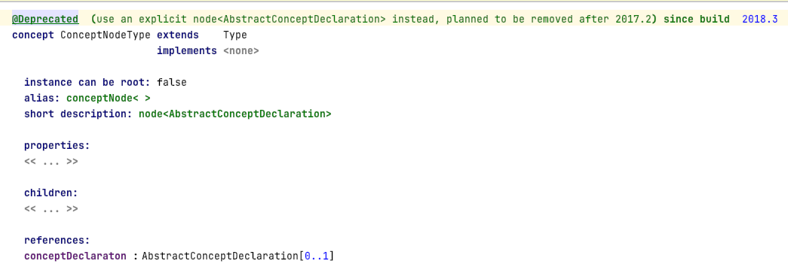
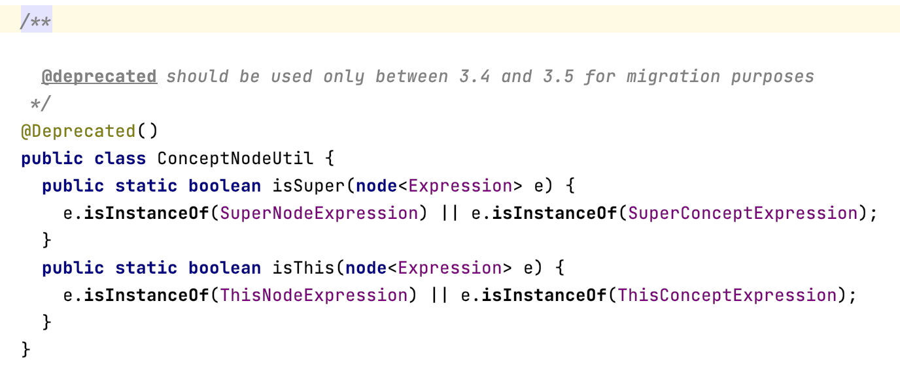
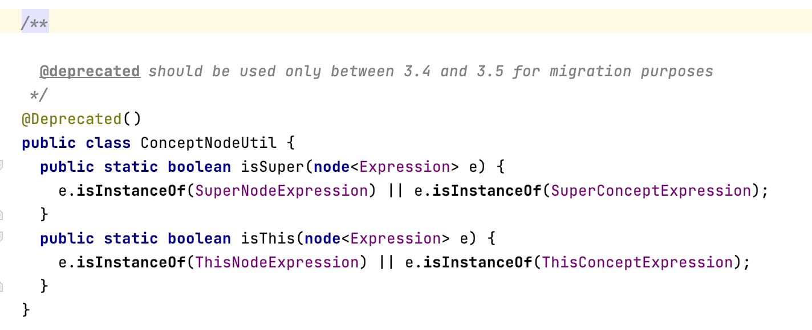

This document lists some recommendations for code written it MPS.

Before reading this document, __read the [mbeddr Development Guide](https://github.com/mbeddr/mbeddr.core/wiki/Development-Guide)__.
It describes how git is used in the mbeddr project for contributing changes, and it also provides some general guidelines ([commit messages](https://github.com/mbeddr/mbeddr.core/wiki/Development-Guide#commit-messages), [branches](https://github.com/mbeddr/mbeddr.core/wiki/Development-Guide#branches), [merging](https://github.com/mbeddr/mbeddr.core/wiki/Development-Guide#merging), [test organization](https://github.com/mbeddr/mbeddr.core/wiki/Development-Guide#test-organization) etc.).

## Readability/Maintainability
- Use enhanced for loops instead of for loops with counters:
  `#!java for(type variable:iterable)` and `#!java foreach variable in iterable`
- Mark classes/concepts etc. as deprecated when they shouldn't be used: 
[DeprecatedNodeAnnotation](http://127.0.0.1:63320/node?ref=r%3A00000000-0000-4000-0000-011c89590292%28jetbrains.mps.lang.structure.structure%29%2F1224240836180)
  
[DeprecatedBlockDocTag](http://127.0.0.1:63320/node?ref=r%3A4095af4f-a097-4799-aaa9-03df087ddfa6%28jetbrains.mps.baseLanguage.javadoc.structure%29%2F8465538089690331492)
  
[Java Deprecated annotation](http://127.0.0.1:63320/node?ref=6354ebe7-c22a-4a0f-ac54-50b52ab9b065%2Fjava%3Ajava.lang%28JDK%2F%29%2F%7EDeprecated)
  
- Use the text ``TODO`` in comments. These strings can be found with the TODO tool.
- Check for redundant variable initializers (typesystem warning).
- Use empty lines between statements (for example method declarations) for readability.
- Use virtual packages to organize your code.

## Null safety
- Use language [checkedDots](https://www.jetbrains.com/help/mps/other-languages.html) for saver access of possible null values. Nodes can be checked for null: [node.isNull](http://127.0.0.1:63320/node?ref=r%3A00000000-0000-4000-0000-011c89590301%28jetbrains.mps.lang.smodel.structure%29%2F1171999116870)
- Use annotation `#!java @NotNull` and `#!java @Nullable` for baselanguage code. There is a typeystem rule in MPS that checks these annotations.
- Use [:eq:](http://127.0.0.1:63320/node?ref=r%3A00000000-0000-4000-0000-011c895902ca%28jetbrains.mps.baseLanguage.structure%29%2F1225271283259) (NPE-safe equals operation) and [\:ne:](http://127.0.0.1:63320/node?ref=r%3A00000000-0000-4000-0000-011c895902ca%28jetbrains.mps.baseLanguage.structure%29%2F1225271221393) 
  NPE-safe not equals operation instead of [==](http://127.0.0.1:63320/node?ref=r%3A00000000-0000-4000-0000-011c895902ca%28jetbrains.mps.baseLanguage.structure%29%2F1068580123152) and `#!java equals`.
- Return optional values instead of null in baselanguage code[^1].

## Exceptions
- Use checked exceptions for recoverable conditions and run-time exceptions for programming errors [^2]^,^[^3].
- Consider alternative ways of showing errors than throwing exceptions such as showing [notifications](https://plugins.jetbrains.com/docs/intellij/notifications.html#top-level-notifications-balloons). Examples for such notifications are balloons and dialogs.
- Attach throwable objects to logging statement if available:
  `#!java log error "This is an error",errorObject`
- Clean up in the finally block of a try statement.

## Swing components
- Use components from the intellij platform. Some additional components can be found [here](https://plugins.jetbrains.com/docs/intellij/misc-swing-components.html). Use the [intellij platform ui guidelines](https://jetbrains.github.io/ui/) to create consistent and usable user interfaces.
- Capitalization: almost all short textual items (menus, buttons, labels, for example) should have headline capitalization, where all words are capitalized except for common words with up to three letters (a, an, the, and, or, so, yet, etc.), and do not appear as the first or last word. If the text is not short, then the capitalization used in ordinary prose (sentence capitalization) should be used instead.
- Read the [Swing tutorials](https://docs.oracle.com/javase/tutorial/uiswing/index.html) to get a better understanding of the components.

[^1]:[Return Optional not null](http://www.javapractices.com/topic/TopicAction.do?Id=279)
[^2]:[Java Best Practices Quick Reference](https://dzone.com/articles/java-best-practices-quick-reference)
[^3]:[Checked versus unchecked exceptions](http://www.javapractices.com/topic/TopicAction.do?Id=129)